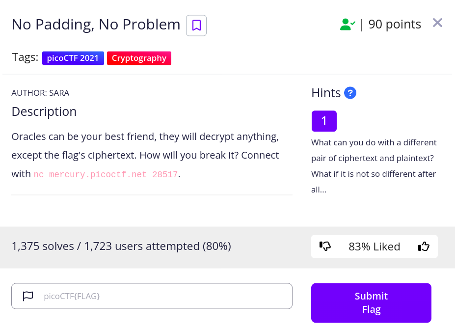
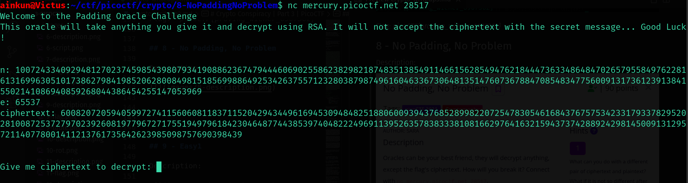
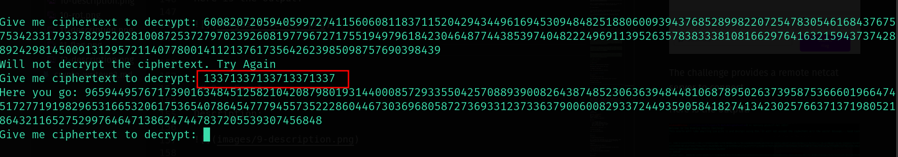
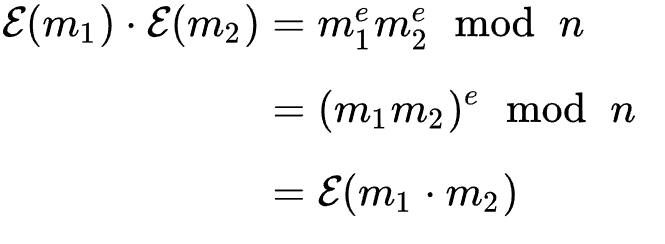
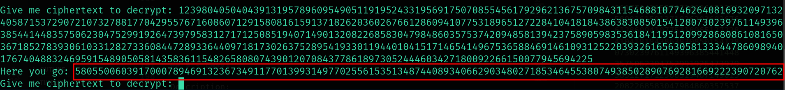

## 8 - No Padding, No Problem

Description:



The challenge provides a remote netcat server to connect. 

Here is the output:



The output produced again indicates that it is an RSA challenge. The catch here is that the server will decrypt any other ciphertext but the ciphertext of the flag produced.



The above output confirms it.

To solve this, we somehow have to do some computations on the encrypted cyphertext and after decrypting the result via the remote server, figure out the way to retrieve the original *m*.

This computation can be done using **Homomorphic encryption**. Homomorphic encryption is a form of encryption that permits users to perform computations on its encrypted data without first decrypting it. These resulting computations are left in an encrypted form which, when decrypted, results in an identical output to that produced had the operations been performed on the unencrypted data.

Read further [here](https://en.wikipedia.org/wiki/Homomorphic_encryption).

This homomorphic property can be used on RSA, where we can multiply the encrypted cypher with another encrypted cypher. It looks something like this:



```
encrypt(m1) * encrypt(m2) = ((m1**e)*(m2**e)) mod n = (m1*m2)**e mod n = encrypt(m1*m2)
```
Now we can choose a value like *2* and encrypt it using ```2**e mod n```. Multiply the result with *ct*. The returned value can be decrypted by the server. Then dividing the decrypted value with *2* will give us our *m1*(flag in long).

Let's first generate our cyphertext from *2*.

```python
>>> n = 77196960392726883554580156611441115778244742170012860665555157727619498736733763357829713658834291727858053259553569066085316968155170947684173186863665521616223125808343841422148241495064856299799068503862091901182936450678917414395655677914058076742731837684385149887031798299700376570681668021348086954481
>>> e = 65537
>>> ct = 37937667697199545731318594883574310251300142279543885001825326419707052170598649977331669242453560367107927193071621702408336030222231612373229545457395037473913062979358200327403781920072528289924374447602946247334631489773773964005474686198243255861093737959604614466777212794342155406101091435105863411945
>>> ct2 = pow(2,e,n)
>>> ct2
32680028205737862058092418560016671912961374483507465049440373300063031728924056734786012716159510686819224143598077939879093985710406587822935385629999767187674361251075813536069505151444466423544652770880863154224017234397879757004895331311018960110407891149347802612056548965797315836132954083325149392105

```
Lets multiply the cyphertext with the original *ct* of the flag.

```python
>>> ct3 = ct2*ct
>>> ct3
1239804050404391319578960954905119195243319569175070855456179296213675709843115468810774626408169320971324058715372907210732788177042955767160860712915808161591371826203602676612860941077531896512722841041818438638308501541280730239761149396385441448357506230475299192647397958312717125085194071490132082268583047984860357537420948581394237589059835361841195120992868086108165036718527839306103312827336084472893364409718173026375289541933011944010415171465414967536588469146109312522039326165630581333447860989401767404883246959154890505814358361154826580807439012070843778618973052444603427180092266150077945694225
```

Slap this calcualted *ct3* into the server to get the decrypted *m1*m2*.



```
m1m2 = 580550060391700078946913236734911770139931497702556153513487440893406629034802718534645538074938502890769281669222390720762

```

Lets now divide the m2 which is *2* with the above value to get m1.

```python
>>> m1m2 = 580550060391700078946913236734911770139931497702556153513487440893406629034802718534645538074938502890769281669222390720762
>>> m1 = m1m2//2
>>> m1
290275030195850039473456618367455885069965748851278076756743720446703314517401359267322769037469251445384640834611195360381
```

Now lets just convert this value into bytes.

```python
>>> hex_flag = hex(m1)[2:]
>>> bytes.fromhex(hex_flag).decode()
'picoCTF{m4yb3_Th0se_m3s54g3s_4r3_difurrent_4005534}'
```

Flag: *picoCTF{m4yb3_Th0se_m3s54g3s_4r3_difurrent_4005534}*

